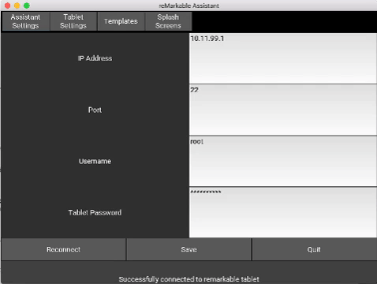

# Remarkable Assistant
Creating an assistant to have more control over the remarkable tablet.

# Warning
This software might brick your tablet. Don't use it if you don't know what
you're doing. 

# What does it do?
Currently you can only use it to change the sleep timeout, power off timeout, 
and the developer password.

# Download
There is currently a [DMG](bin/RemarkableAssistant.dmg) for Mac in the bin directory

# Windows Installation
1. Make sure you have python 2.7 and pip installed.
2. This requires at least OpenGL 2 or greater
3. This assumes your Python exectuable is in C:\Python27

Once the above is verified, run the following commands:

`C:\Python27\python.exe -m pip install --upgrade pip`

`C:\Python27\pythone.exe -m pip install -r windows-requirements.txt`

Run the application:

`C:\Python27\python.exe src\main.py`

# Installing for everyone else:
Install the requirements:

`pip install -r requirements.txt`

Run the application:

`python src/main.py`

# How to use it
1. Plug your remarkable tablet into your computer via USB
2. Set the password the remarkable ssh password you see under rM->About
3. Click the 'Reconnect' button so the assistant will pull down your config
4. Remarkable Assistant should fill in the missing fields with the current values
5. You can now change the new password and timeout fields
6. When you're ready to save press the save button to push files to the tablet
7. Use the quit button to clean up temporary files

